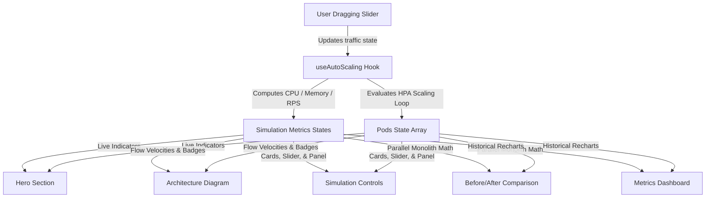

# Code Walkthrough — Scaling the Lunch Rush

This walkthrough details the structural organization, file functions, data flows, and component layouts of the **Scaling the Lunch Rush** interactive web application.

---

## 1. Directory Structure

```text
├── package.json                   # Dependency definition & build configuration
├── tailwind.config.js             # Theme customizations & color configurations
├── postcss.config.js              # CSS post-processing setup
├── vite.config.js                 # Bundler configurations for Dev & Production
├── index.html                     # Application mounting entry shell
├── src/
│   ├── main.jsx                   # React application bootstrap entry
│   ├── App.jsx                    # Root orchestrator & layout manager
│   ├── index.css                  # Core design system tokens, animations, & styles
│   ├── hooks/
│   │   └── useAutoScaling.js      # Simulation state machine & metrics engine
│   └── components/
│       ├── Navbar.jsx             # Navigation bar with dark mode toggle
│       ├── Footer.jsx             # Project info links and footer layout
│       ├── HeroSection.jsx        # Live-metric cluster status hero header
│       ├── ProblemSection.jsx     # Scenario narrative highlighting monolithic failures
│       ├── SolutionSection.jsx    # Introduction to Kubernetes core concepts
│       ├── K8sArchitecture.jsx    # SVG routing topography diagram
│       ├── AutoScalingSimulation.jsx # Interactive controls, pod cards & chaos panel
│       ├── BeforeAfterComparison.jsx # Side-by-side monolith vs K8s stats
│       ├── DevOpsPipeline.jsx     # Static CI/CD pipeline presentation
│       ├── MetricsDashboard.jsx   # Live charting (Recharts) & system summary
│       └── ConclusionSection.jsx  # Scalability benefits summary
```

---

## 2. Component Blueprint

### A. Root Orchestration

*   **[App.jsx](file:///Users/nikhilchhetri/kubernets/devops/scaling-lunch-rush/src/App.jsx)**
    *   Initializes the custom `useAutoScaling` hook.
    *   Manages dark/light mode state and mounts dark-mode classes to document elements.
    *   Renders all structural page components in hierarchical order, distributing the active simulation state hook to reactive children (`HeroSection`, `K8sArchitecture`, `AutoScalingSimulation`, `BeforeAfterComparison`, `MetricsDashboard`).
*   **[index.css](file:///Users/nikhilchhetri/kubernets/devops/scaling-lunch-rush/src/index.css)**
    *   Imports Tailwind base and extends base styles for scrolling/layout defaults.
    *   Configures system status badge themes (`.status-healthy`, `.status-degraded`, etc.).
    *   Sets keyframe animations for SVG request flows (`@keyframes flowHorizontal`, `@keyframes flowVertical`) and floating icons.

### B. Core State Hook

*   **[useAutoScaling.js](file:///Users/nikhilchhetri/kubernets/devops/scaling-lunch-rush/src/hooks/useAutoScaling.js)**
    *   **Per-Pod Object Model**: Stores a list of active pod objects with lifecycle states (`Pending → Healthy → Terminating/Failed`).
    *   **Interactive Chaos Actions**: Exposes functions (`killPod`, `killNode`, `recoverNode`, `simulateMemoryLeak`, `simulateNetworkFailure`) to introduce simulated system anomalies.
    *   **HPA Scaling Logic**: Triggers autoscaling evaluation loop on an `800ms` interval tick, adding/removing pod replicas based on average target CPU thresholds.

### C. Live Dashboards & TOPOGRAPHY

*   **[HeroSection.jsx](file:///Users/nikhilchhetri/kubernets/devops/scaling-lunch-rush/src/components/HeroSection.jsx)**
    *   Combines the project title fold with a high-fidelity system status grid.
    *   Includes a terminal log view demonstrating event actions in real-time.
*   **[K8sArchitecture.jsx](file:///Users/nikhilchhetri/kubernets/devops/scaling-lunch-rush/src/components/K8sArchitecture.jsx)**
    *   An interactive visual mapping of cluster topology: Public Ingress → Ingress Controller → Cluster IP Service → Worker Nodes (pods) → DB Volume.
    *   Framer-motion and dynamic SVG dashed lines simulate flowing requests. Speed scales with traffic. Failed nodes halt data flow dynamically.
*   **[AutoScalingSimulation.jsx](file:///Users/nikhilchhetri/kubernets/devops/scaling-lunch-rush/src/components/AutoScalingSimulation.jsx)**
    *   Contains the master load slider to increase or decrease mock traffic metrics.
    *   Renders detailed pod metrics cards showing CPU/Memory bars per-pod.
    *   Provides button actions to inject failure vectors (killing node instances, creating memory leak OOM errors, and adding database latency).
*   **[BeforeAfterComparison.jsx](file:///Users/nikhilchhetri/kubernets/devops/scaling-lunch-rush/src/components/BeforeAfterComparison.jsx)**
    *   Takes the current slider traffic state and compares a monolithic app instance vs a multi-node, autoscaled Kubernetes cluster.
    *   Shows a visual crash state (red alerts and high latency) for the monolith when traffic peaks.

---

## 3. Data Flow



---

## 4. Failure Modes & Chaos Simulation

The simulation engine models production failures:

1.  **Pod Crash (`killPod`)**: Terminating a pod forces its state to `Failed` instantly. Kubernetes detects the discrepancy against target replicas and launches a new replacement pod in `Pending` status.
2.  **Node Down (`killNode`)**: Marking a node as offline evicts all host pods. The scheduler relocates replica pods to the remaining healthy node (or stops rescheduling if both nodes fail).
3.  **Memory Leak (`simulateMemoryLeak`)**: The selected pod's memory increases by 8-15% per tick. When usage reaches 100%, the process triggers an `OOMKilled` event, terminating the container and triggering a rescheduling event.
4.  **Network Delay (`simulateNetworkFailure`)**: Spikes system latency parameters globally for a period of ~8 seconds, creating high error rates on logs before recovering automatically.
